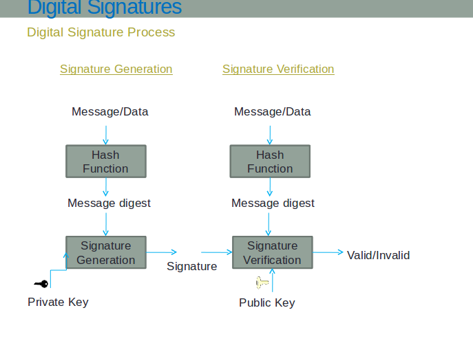

For a very brief theory of digital signature schemes and their analysis, click [here](docs/dss1.pdf)

Digital signatures are cryptographic mechanisms that provide authentication, integrity, and non-repudiation for digital documents and messages. Unlike handwritten signatures, digital signatures use mathematical algorithms to ensure that a document hasn't been altered and to verify the identity of the signer.

### How Digital Signatures Work

The digital signature process involves three main phases:

**1. Hash Generation:**
$$h = H(m)$$
The original message $m$ is processed through a cryptographic hash function $H$ (such as SHA-256) to create a fixed-size digest $h$.

**2. Signature Creation:**
$$s = \text{Sign}_{sk}(h) = h^d \bmod n$$
The hash $h$ is encrypted using the signer's private key $d$ to create the digital signature $s$.

**3. Verification:**

$$
\text{Verify}_{pk}(m, s) = \begin{cases}
\text{Valid} & \text{if } H(m) = s^e \bmod n \\
\text{Invalid} & \text{otherwise}
\end{cases}
$$

Recipients can verify the signature using the signer's public key $e$ to decrypt the signature and compare it with a freshly computed hash.

### RSA-Based Digital Signatures

RSA (Rivest-Shamir-Adleman) is widely used for digital signatures due to its mathematical foundation:

**Key Properties:**

- **Key Generation**: Create a public-private key pair $(e, n)$ and $(d, n)$
- **Signing**: Encrypt the message hash with the private key: $s = H(m)^d \bmod n$
- **Verification**: Decrypt the signature with the public key: $H(m) \stackrel{?}{=} s^e \bmod n$

**RSA Security Assumption:**
The security of RSA digital signatures relies on the difficulty of the **Integer Factorization Problem**:
$$\text{Given } n = p \times q \text{, find } p \text{ and } q$$

**Trapdoor Function:**
RSA uses a trapdoor one-way function where:

- **Easy direction**: Computing $y = x^e \bmod n$ is efficient
- **Hard direction**: Computing $x = y^d \bmod n$ without knowing $d$ is computationally infeasible

### Mathematical Representation

For RSA digital signatures:

**Signature Generation:**
$$s = H(m)^d \bmod n$$

**Signature Verification:**
$$H(m) = s^e \bmod n$$

Where:

- $H(m)$ is the hash of message $m$
- $d$ is the private key exponent
- $e$ is the public key exponent
- $n$ is the modulus ($n = p \times q$ for primes $p$ and $q$)

**RSA Key Generation Process:**

1. Choose two large prime numbers $p$ and $q$
2. Compute $n = p \times q$
3. Compute Euler's totient function: $\phi(n) = (p-1)(q-1)$
4. Choose public exponent $e$ such that $1 < e < \phi(n)$ and $\gcd(e, \phi(n)) = 1$
5. Compute private exponent $d$ such that $d \equiv e^{-1} \pmod{\phi(n)}$

**Digital Signature Algorithm Steps:**

_Signing Process:_

1. Compute message hash: $h = H(m)$
2. Generate signature: $s = h^d \bmod n$
3. Send $(m, s)$ to verifier

_Verification Process:_

1. Compute message hash: $h' = H(m)$
2. Decrypt signature: $h'' = s^e \bmod n$
3. Verify: signature is valid if $h' = h''$

### Security Properties

Digital signatures provide three key security properties:

1. **Authentication**: Verifies the identity of the message sender
2. **Integrity**: Ensures the message hasn't been modified
3. **Non-repudiation**: Prevents the sender from denying they signed the message

### Key Size Considerations

The security of RSA digital signatures depends on key size and computational complexity:

| Key Size     | Security Level               | Factorization Complexity      | Use Case                |
| ------------ | ---------------------------- | ----------------------------- | ----------------------- |
| **512-bit**  | $\approx 2^{86}$ operations  | Vulnerable to modern attacks  | Educational only        |
| **1024-bit** | $\approx 2^{103}$ operations | Moderate security             | Legacy systems          |
| **2048-bit** | $\approx 2^{112}$ operations | Currently recommended minimum | Production use          |
| **4096-bit** | $\approx 2^{140}$ operations | High security                 | High-value applications |

**Security Growth:**
The security of an $n$-bit RSA key against factorization attacks is approximately:
$$\text{Security} \approx 2^{\frac{1.9 \times (\log_2 n)^{1/3} \times (\log \log_2 n)^{2/3}}{3}}$$

**Performance vs Security Trade-off:**

- **Signature time**: $O((\log n)^3)$ for $n$-bit keys
- **Verification time**: Typically faster due to small public exponent $e$ (often $e = 65537 = 2^{16} + 1$)
- **Key generation time**: Increases significantly with key size due to primality testing
